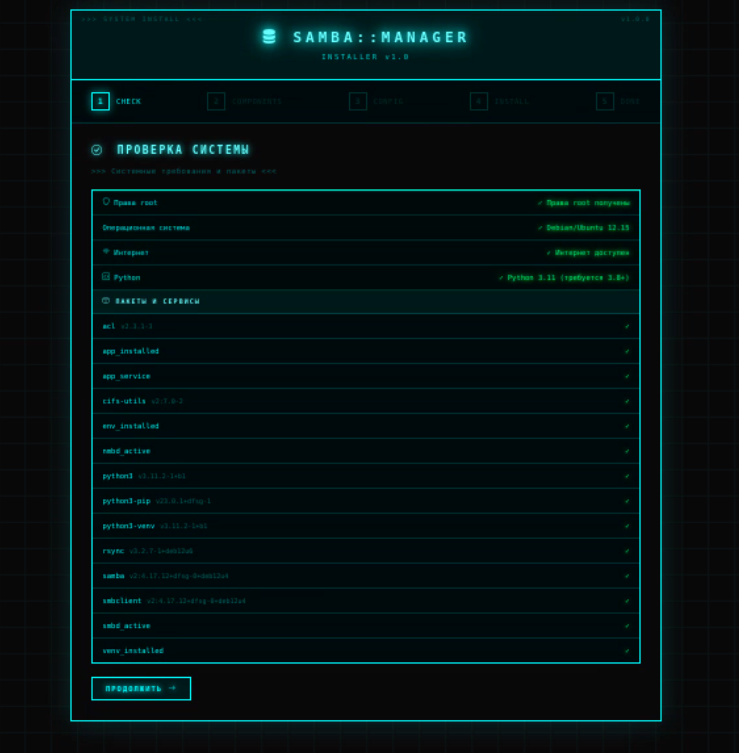
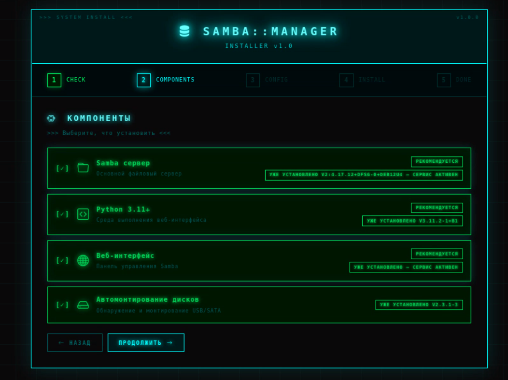
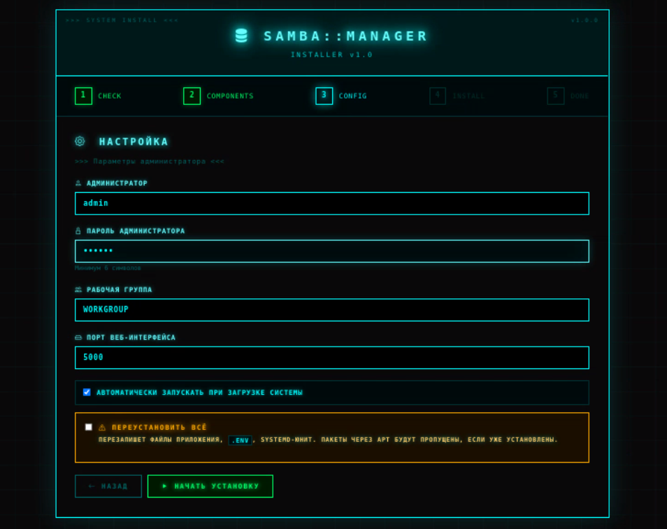
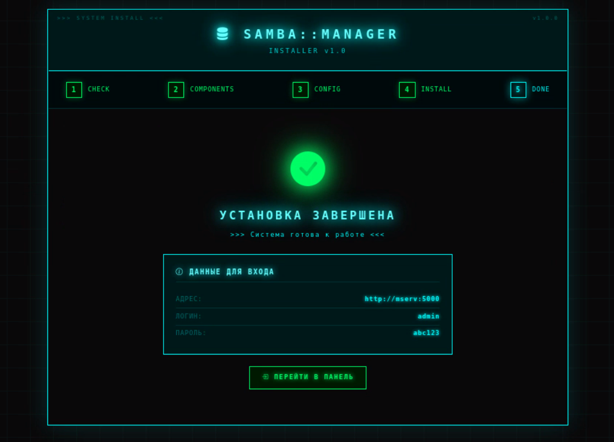
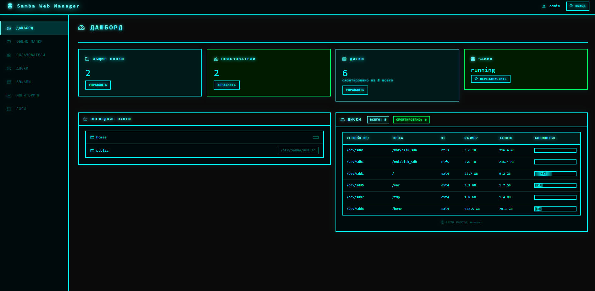
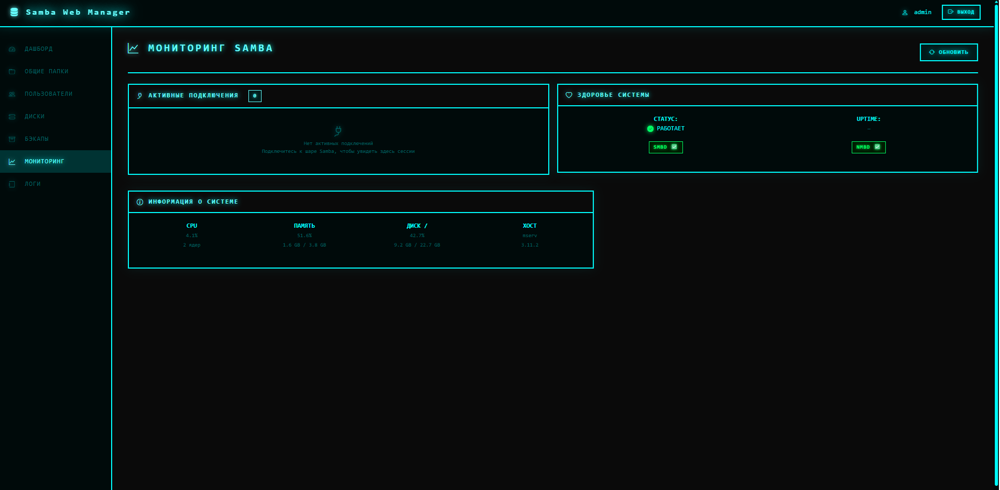
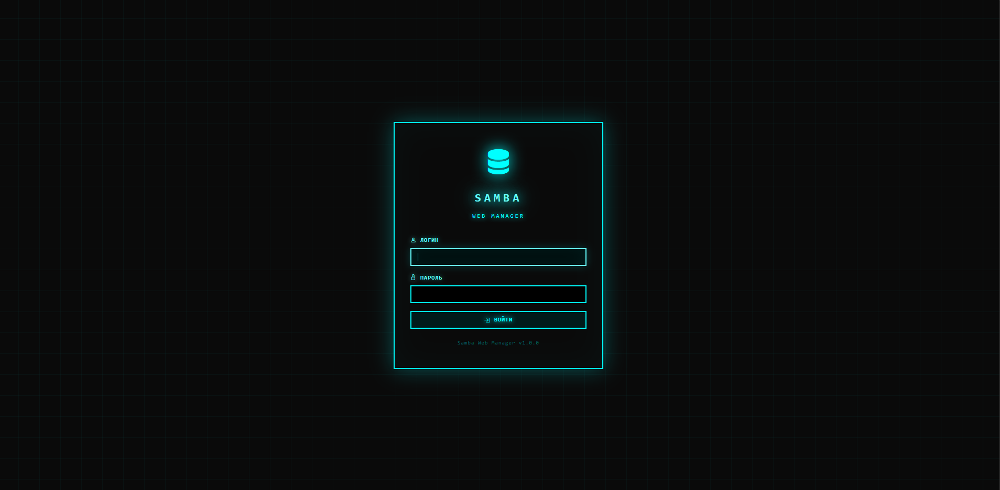

# 📥 Samba Web Manager — Установщик

Веб-установщик для управления Samba через браузер. Работает на Debian 11+ / Ubuntu 20.04+.

---

## 🚀 Быстрый старт

```bash
git clone https://github.com/Development-Day/samba-web-manager-install.git
cd samba-web-manager-install
sudo python3 installer_app.py
```

Откройте в браузере: **http://IP-сервера:5001**

Мастер проведёт по шагам: проверка системы → выбор компонентов → настройка → установка → готово.



---

## 📋 Что нужно

| Компонент | Минимум |
|---|---|
| ОС | Debian 11 / Ubuntu 20.04 |
| RAM | 256 МБ |
| Диск | 300 МБ |
| Python | 3.8 |
| Права | root / sudo |

---

## 🔌 Порты

| Порт | Что | Когда |
|---|---|---|
| 5001 | Веб-установщик | Во время установки |
| 5000 | Панель управления | После установки |
| 445 | Samba (SMB) | Всегда |

---

## 🧩 Что можно установить

- **Samba** — файловый сервер (рекомендуется)
- **Python 3.11+** — среда выполнения (рекомендуется)
- **Веб-интерфейс** — панель управления (рекомендуется)
- **Автомонтирование дисков** — опционально

Уже установленные компоненты определяются автоматически и пропускаются.


---

## 🔧 Параметры

На шаге «Настройка» задаются:

- **Логин администратора** — по умолчанию `admin`
- **Пароль** — минимум 6 символов
- **Рабочая группа** — по умолчанию `WORKGROUP`
- **Порт панели** — по умолчанию `5000`

Все параметры сохраняются в `/opt/samba-web-manager/.env` с правами `600`.


---

## ♻️ Переустановка

Если компоненты уже установлены — включите **«Переустановить всё»** на шаге «Настройка». Это:

- перезапишет файлы приложения,
- обновит `.env` и systemd-юнит,
- **не** тронет пакеты, установленные через `apt`.

---

## ✅ После установки

1. Откройте **http://IP-сервера:5000**
2. Войдите под логином и паролем, указанными при установке.
3. Пароль можно посмотреть в `.env`:

```bash
sudo grep ADMIN_PASSWORD /opt/samba-web-manager/.env
```

---

## 🗑️ Удаление

```bash
sudo bash full-cleanup.sh          # мягкое (без apt purge)
sudo bash full-cleanup.sh --purge  # полное
```

Проверка чистоты системы:

```bash
sudo bash check-clean.sh
```

---

## 🐛 Если что-то пошло не так

| Симптом | Решение |
|---|---|
| `ModuleNotFoundError: flask` | `sudo apt install python3-flask` |
| Порт 5001 занят | `sudo fuser -k 5001/tcp` |
| CSS/JS отображаются как текст | Обновите `installer_app.py` (используется `send_from_directory`) |
| «Не выбраны компоненты» | Включите «Переустановить всё» |
| Сервис не запускается | `sudo journalctl -u samba-web -n 50 --no-pager` |

Подробнее — в [Решение проблем](samba-web-manager/docs/TROUBLESHOOTING.md).

---

## 📚 Документация

### Установщик

- [Проверка чистоты](check-clean.sh)
- [Полное удаление](full-cleanup.sh)
- [Тесты](test_full.sh)

### Программа

- [README программы](samba-web-manager/README.md)
- [Ручная установка](samba-web-manager/docs/INSTALL.md)
- [Конфигурация](samba-web-manager/docs/CONFIGURATION.md)
- [REST API](samba-web-manager/docs/REST-API.md)
- [Решение проблем](samba-web-manager/docs/TROUBLESHOOTING.md)
- [Как помочь проекту](samba-web-manager/CONTRIBUTING.md)

---

## 📜 Лицензия

MIT License. Copyright (c) 2026 Development-Day.

# 🚀 Samba Web Manager

**Веб-интерфейс для управления Samba на Debian 11+ / Ubuntu 20.04+**

Забудьте про редактирование `smb.conf` вручную. Управляйте общими папками, пользователями и дисками через удобный веб-интерфейс.

[](https://www.debian.org/)
[](https://ubuntu.com/)
[](https://www.python.org/)
[](LICENSE)



---

## ✨ Возможности

### 📂 Управление общими папками

- Создание, редактирование, удаление шар.
- Настройка прав (чтение/запись, гости, valid users).
- Автоматическая перезагрузка Samba.

### 👤 Управление пользователями

- Создание пользователей Samba (системный + `smbpasswd`).
- Смена паролей.
- Включение/отключение аккаунтов.
- Удаление (из Samba + из системы).

### 💾 Управление дисками

- Автоматическое обнаружение USB, SATA, NVMe.
- Монтирование с добавлением в `/etc/fstab`.
- Автомонтирование при подключении.
- Автоматическое создание Samba-шар для дисков.

### 🔒 Безопасность

- Авторизация в веб-интерфейсе.
- Защита API (сессионные cookie).
- ACL права доступа.
- Аудит действий (логи).

### 📦 Дополнительно

- Бэкапы конфигурации с ротацией.
- Мониторинг активных подключений.
- Проверка здоровья Samba (`/health`).
- Управление через REST API.

---

## ⚡ Установка

### Требования

| Компонент | Минимум | Рекомендуется |
|---|---|---|
| ОС | Debian 11 / Ubuntu 20.04 | Debian 12 / Ubuntu 22.04 |
| RAM | 256 МБ | 512 МБ |
| Диск | 300 МБ | 1 ГБ |
| Python | 3.8 | 3.11 |
| Права | root / sudo | root / sudo |

### Порты

| Порт | Назначение | Как изменить |
|---|---|---|
| **5000** | Веб-интерфейс | Переменная `PORT` в `.env` |
| 445 | SMB (Samba) | `/etc/samba/smb.conf` |
| 139 | NetBIOS | `/etc/samba/smb.conf` |
| 137/udp | NetBIOS Name Service | `/etc/samba/smb.conf` |
| 138/udp | NetBIOS Datagram | `/etc/samba/smb.conf` |

Если порт 5000 занят — измените в `/opt/samba-web-manager/.env` и перезапустите сервис.

### Способ 1: Bash-установщик (быстрый)

```bash
# 1. Клонировать репозиторий
git clone https://github.com/Development-Day/samba-web-manager.git
cd samba-web-manager

# 2. Запустить установщик
sudo ./install.sh
```

### Способ 2: Веб-установщик (пошаговый мастер)

```bash
cd samba-web-manager-install
sudo python3 installer_app.py
```

Откройте в браузере `http://<IP-сервера>:5001`.

Мастер проведёт по шагам:

1. Проверка системы.
2. Выбор компонентов.
3. Настройка (логин/пароль).
4. Установка.
5. Готово.

### После завершения установки

Откройте в браузере `http://IP-сервера:5000`.

- **Логин:** `admin`
- **Пароль:** сохранён в `/opt/samba-web-manager/.env`

```bash
sudo grep ADMIN_PASSWORD /opt/samba-web-manager/.env
```

> 🔐 **Важно:** смените пароль после первого входа.



### Смена пароля администратора

```bash
# 1. Открыть .env
sudo nano /opt/samba-web-manager/.env

# 2. Изменить строку
# ADMIN_PASSWORD=NewPassw!

# 3. Перезапустить сервис
sudo systemctl restart samba-web
```

---

## ✅ Проверка установки

```bash
# Статус сервиса
sudo systemctl status samba-web

# Healthcheck
curl -s http://localhost:5000/health
# {"status":"ok","name":"Samba Web Manager","version":"1.0.0"}

# Полная проверка системы
sudo /opt/samba-web-manager/check_installation.sh
```

---

## 📊 Управление сервисом

```bash
# Статус
sudo systemctl status samba-web

# Запуск / остановка / перезапуск
sudo systemctl start samba-web
sudo systemctl stop samba-web
sudo systemctl restart samba-web

# Логи systemd
sudo journalctl -u samba-web -f
sudo journalctl -u samba-web -n 100 --no-pager
```

### Логи приложения (gunicorn)

```bash
sudo tail -f /opt/samba-web-manager/logs/access.log
sudo tail -f /opt/samba-web-manager/logs/error.log
```

---

## 🔥 Firewall

Если используете `ufw`, откройте порты:

```bash
sudo ufw allow 5000/tcp    # веб-интерфейс
sudo ufw allow 445/tcp     # Samba
sudo ufw reload
```

---

## 📁 Структура

### Приложение

```
/opt/samba-web-manager/
├── app.py                        # Flask-приложение
├── wsgi.py                       # WSGI-точка входа (gunicorn)
├── config.py                     # Конфигурация
├── requirements.txt
├── install.sh                    # Установщик
├── uninstall.sh                  # Удаление
├── check_installation.sh         # Проверка системы
├── test_dashboard.sh             # Тесты
├── venv/                         # Python-окружение
├── samba_manager/                # Модули Samba
│   ├── config_parser.py          # Работа с smb.conf
│   ├── users.py                  # Пользователи
│   ├── service.py                # systemctl-обёртка
│   ├── disks.py                  # Диски
│   ├── backup.py                 # Бэкапы
│   └── monitoring.py             # Мониторинг
├── templates/                    # HTML-шаблоны (Jinja2)
├── static/                       # CSS / JS
│   ├── css/style.css
│   └── js/{app,shares,users}.js
├── logs/                         # Логи
│   ├── app.log                   # Flask
│   ├── access.log                # gunicorn access
│   └── error.log                 # gunicorn errors
├── backups/                      # Бэкапы smb.conf
└── .env                          # Пароли (chmod 600)
```

### Системные файлы

```
/etc/samba/smb.conf                     # Конфиг Samba
/etc/systemd/system/samba-web.service   # systemd-юнит
/etc/sudoers.d/samba-web                # NOPASSWD-правила
/srv/samba/                             # Общие папки
```

---

## 🔧 Полезные команды

### Samba

```bash
# Проверить конфиг
sudo testparm -s

# Список пользователей Samba
sudo pdbedit -L

# Активные подключения
sudo smbstatus

# Перезапустить Samba
sudo systemctl restart smbd nmbd
```

### Приложение

```bash
# Сменить пароль администратора
sudo nano /opt/samba-web-manager/.env
# Изменить строку ADMIN_PASSWORD=...
sudo systemctl restart samba-web

# Сгенерировать новый SECRET_KEY
python3 -c "import secrets; print(secrets.token_hex(32))"
```

### Firewall (ufw)

```bash
# Открыть порт веб-интерфейса
sudo ufw allow 5000/tcp

# Открыть порты Samba
sudo ufw allow Samba
```

---

## 🧪 Тестирование

```bash
cd /opt/samba-web-manager
sudo ./test_dashboard.sh
```

Скрипт проверяет 16 сценариев (~40 проверок):

- ✅ Healthcheck
- ✅ Страница логина и авторизация
- ✅ Все HTML-страницы (7 шт.)
- ✅ CRUD шар (создание, чтение, удаление)
- ✅ CRUD пользователей (создание, пароль, удаление)
- ✅ API (статус, диски, бэкапы)
- ✅ Дашборд с дисками
- ✅ Logout и защита API после выхода

---

## 🐛 Решение проблем

### Сервис не запускается

```bash
# Смотрим логи
sudo journalctl -u samba-web -n 50 --no-pager

# Проверяем конфиг
sudo -u samba-web /opt/samba-web-manager/venv/bin/python -c "from wsgi import app; print('OK')"
```

**Частые причины:**

| Симптом | Причина | Решение |
|---|---|---|
| `SECRET_KEY не задан` | Нет `SECRET_KEY` в `.env` | Добавить в `.env`, перезапустить |
| `Address already in use` | Порт 5000 занят | Сменить `PORT` в `.env` |
| `ModuleNotFoundError` | Не установлены зависимости | `cd /opt/samba-web-manager && sudo -u samba-web venv/bin/pip install -r requirements.txt` |
| `Permission denied` | Неверные права | `sudo chown -R samba-web:samba-web /opt/samba-web-manager` |

### Не открывается веб-интерфейс

```bash
# Слушает ли порт?
sudo ss -tlnp | grep 5000

# Firewall?
sudo ufw status
sudo ufw allow 5000/tcp

# Локально работает?
curl -s http://localhost:5000/health
```

Если локально работает, а извне — нет, проблема в firewall.

### Не логинится

```bash
# Проверить пароль в .env
sudo grep ADMIN_PASSWORD /opt/samba-web-manager/.env

# Проверить, что SESSION_COOKIE_SECURE=False (для HTTP)
sudo grep SESSION_COOKIE_SECURE /opt/samba-web-manager/.env
```

> Если `SESSION_COOKIE_SECURE=True` без HTTPS — cookie не передаются, логин не работает.

### Дашборд показывает 0 дисков

Проверьте, что `app.py` содержит поля `disks`, `mounted_disks`, `total_disks` в `/api/system/info`:

```bash
PASS=$(sudo grep -E '^ADMIN_PASSWORD=' /opt/samba-web-manager/.env \
        | head -n1 | cut -d= -f2-)
COOKIE=$(mktemp)
trap 'rm -f "$COOKIE"' EXIT

curl -s -c "$COOKIE" -X POST http://localhost:5000/login \
    --data-urlencode "username=admin" \
    --data-urlencode "password=$PASS" > /dev/null

curl -s -b "$COOKIE" http://localhost:5000/api/system/info | \
    python3 -c "import sys,json; d=json.load(sys.stdin); print('total:', d.get('total_disks'), 'mounted:', d.get('mounted_disks'))"
```

Если `None` — обновите `app.py` (см. актуальную версию).

### Samba не работает

```bash
sudo systemctl status smbd nmbd
sudo testparm
```

---

## 🗑️ Удаление

```bash
cd /opt/samba-web-manager
sudo ./uninstall.sh
```

Скрипт удалит приложение, но сохранит:

- `/etc/samba/smb.conf` — ваши шары,
- `/srv/samba/` — ваши файлы,
- пользователей Samba.

Для полного удаления (включая Samba и все данные):

```bash
sudo ./uninstall.sh --full
```

Для автоматизации (без подтверждений):

```bash
sudo ./uninstall.sh --yes
sudo ./uninstall.sh --full --yes
```

---

## 📊 Ресурсы

| Компонент | RAM | Диск |
|---|---|---|
| Чистая Samba | ~80 МБ | ~30 МБ |
| Samba Web Manager | ~80–150 МБ | ~150 МБ (с venv) |

*Замеры на Debian 12, Python 3.11, gunicorn (2 воркера gevent), idle.*

---

## 🗺️ Roadmap

- [x] **v1.0.0** — базовый функционал (шары, пользователи, диски, бэкапы, мониторинг)
- [ ] **v1.1.0** — групповое управление пользователями
- [ ] **v1.2.0** — двухфакторная аутентификация (2FA)
- [ ] **v1.3.0** — интеграция с LDAP / Active Directory
- [ ] **v1.4.0** — уведомления (Telegram, Email)
- [ ] **v2.0.0** — Docker-версия с одной командой

---

## 🔌 Подключение к шарам

После установки и настройки шары доступны по сети.

### Windows

Проводник → `Win+R` → `\\192.0.2.10\public`

Или через «Сеть»:

1. Откройте «Этот компьютер».
2. Слева → «Сеть».
3. Найдите сервер → откройте шару.

### Linux

```bash
# Список шар
smbclient -L //192.0.2.10 -N

# Подключиться
smbclient //192.0.2.10/public -N
```

### macOS

Finder → `Cmd+K` → `smb://192.0.2.10/public`

### Android / iOS

Приложения: Solid Explorer, ES File Explorer, Files by Google.

1. Добавить SMB-подключение.
2. Хост: `192.0.2.10`.
3. Шара: `public`.

---

## 📖 Документация

- [Установка и настройка](docs/INSTALL.md)
- [Конфигурация](docs/CONFIGURATION.md)
- [REST API](docs/API.md)
- [Решение проблем](docs/TROUBLESHOOTING.md)

---

## 🤝 Contributing

Приветствуются pull request'ы! См. [CONTRIBUTING.md](CONTRIBUTING.md).

---

## 📝 Лицензия

MIT — используйте свободно. См. [LICENSE](LICENSE).

---

## 🙏 Благодарности

- [Bootstrap](https://getbootstrap.com/) — UI
- [Samba](https://www.samba.org/) — файловый сервер
- [Flask](https://flask.palletsprojects.com/) — веб-фреймворк

Сделано с ❤️ для упрощения работы с Samba.
